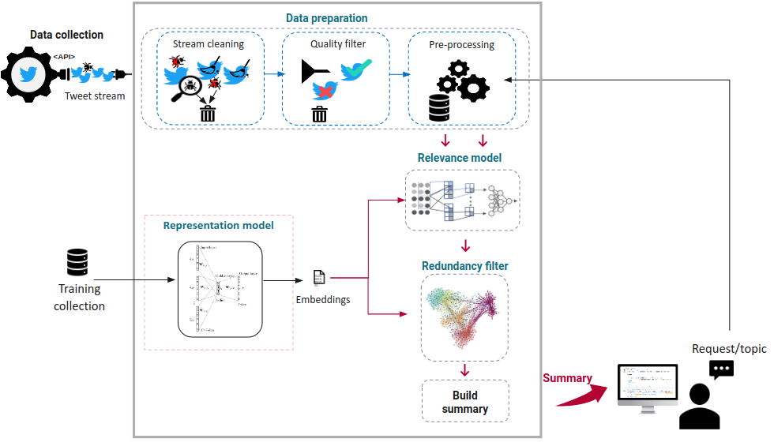
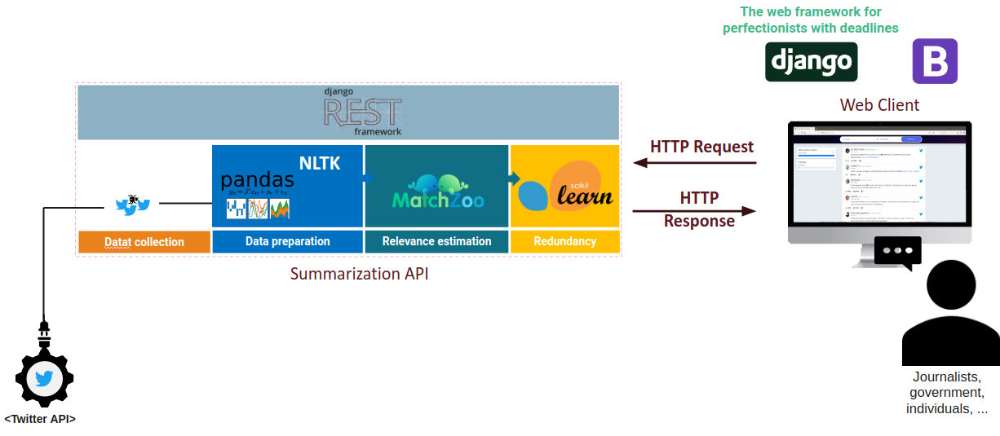

# Neural models for extractive tweet summarization
This repository contains the code for reproducing the experiments of our CIRLE 2020 paper: "Retrospective Tweet Summarization: Investigating NeuralApproaches for Tweet Retrieval".

## General pipeline


## Web Application 
The ```RestAPP``` contains the code of the tweet sumarization api, the ```WebClient``` is a simple web interface for tweet summarization given the user introduced topic.


